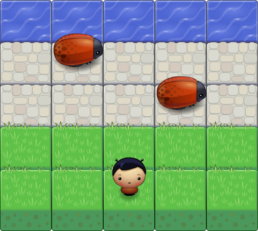
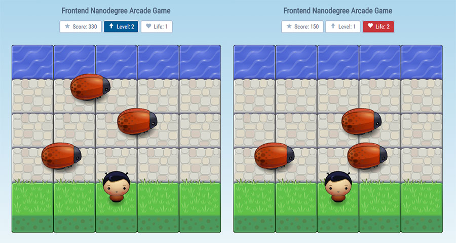

# frontend-nanodegree-arcade-game
Olá! Meu nome é **Paulo Freitas Nobrega** e esta é a minha versão do Frontend Nanodegree Arcade Game da Udacity. Você pode acessar a rúbrica do projeto neste link: (https://review.udacity.com/#!/projects/2696458597/rubric).

### História do Jogo
Na minha versão do jogo o personagem principal tem sua cidade invadida por insetos gigantes. Mas fique atento, seu personagem não sabe nadar, portanto, evite a água. Talvez você não gostou da ideia, e prefere a versão original da rúbrica, onde o personagem deve alcançar a água para ganhar pontos. Neste caso, eu desenvolvi uma versão para isso. Você poderá obtê-la neste link:

### Como Jogar?
Como mencionei acima, o objetivo do jogo é desviar dos insetos gingantes. A cada inseto que atravessa todo o cenário (10 pontos) são creditados no placar. Ao acumular pontos, o nível de jogo aumenta, aumentando também a dificuldade. Isso acontece porque os inimigos estão diretamente ligados ao nível de jogo. Quanto maior o nível, maior será a velocidade deles.

O personagem inicia o jogo com três vidas. Quando um inseto o atinge ou o mesmo cai na água, uma de suas vidas é retirada do placar do jogo. E quando as vidas acabam, o jogo chega ao fim. Mas não se preocupe, esporadicamente bônus aparecerão pelo cenário, e ao coletá-los, pontos e vidas extras serão creditados no placar.

O jogo não tem fim! seu objetivo é ultrapassar seus próprios limites, batendo seu próprio recorde de pontos ou o recorde de seus amigos, mostrando que você é um verdadeiro campeão.

Então bom jogo e divirta-se!

###### Controle do Jogo
- <kbd>Up</kbd>
- <kbd>Right</kbd>
- <kbd>Down</kbd>
- <kbd>Left</kbd>
- <kbd>Space Bar</kbd> - Pause

### Instalação
Você pode fazer o download do arquivo **.zip** diretamente neste link: (https://github.com/paulofreitasnobrega/frontend-nanodegree-arcade-game/archive/master.zip)

Ou se preferir poderá utilizar o git:

```git
git clone https://github.com/paulofreitasnobrega/frontend-nanodegree-arcade-game.git
```
# Para Desenvolvedores
Agora vou comentar sobre algumas sessões e códigos específicos.

## Configuração
Em **config.js** você encontrará as configurações de praticamente todas as partes do jogo. Você pode brincar e alterá-las, mas tome cuidado, essas configurações afetam como o jogo se comporta. Por essa razão, sugiro que estude o comportamento dos códigos antes de fazer qualquer alteração permanente.

Abaixo você verá um pequeno trecho do arquivo de configuração. Este trecho é responsável pela representação das linhas do cenário (falaremos sobre o cenário um pouco à frente). Ou seja, define a quantidade de linhas que cada superfície de terreno possui. Neste caso, o cenário possuirá um total de 05 linhas, agrupadas da seguinte forma:

- 01 Superfície de Água
- 03 Superfícies de Pedra
- 01 Superfície de Grama

```javascript
rows: {
    water: 1,
    stone: 3,
    grass: 1
}
```

Veja o resultado:


Vamos tentar uma pequena mudança.

```javascript
rows: {
    water: 1,
    stone: 2,
    grass: 2
}
```



Legal. Agora o cenário possui 02 superfície de grama.

## Cenário e Rotas
Agora vamos falar um pouco sobre o cenário e suas rotas. Pense que neste jogo, o cenário é simplemente uma tabela, formada por linhas e colunas. Junte o trecho do código acima com a quantidade de colunas e terá essa configuração:

```javascript
cols: 5,
rows: {
    water: 1,
    stone: 3,
    grass: 1
}
```
Você já deve ter imaginado o resultado. Um cenário de 05 colunas por 05 linhas possuindo 25 células. Não há nada de especial nisso, certo? Então vamos falar de algo um pouco mais interessante - **rotas**.

Rotas são estradas que seus inimigos percorrerão. Pontos comuns no eixo Y que mantem os inimigos trafegando por referências imaginárias próximas ao centro de cada linha do cenário. Resumindo, cada linha do cenário possuirá uma rota.

Um dos arquivos responsáveis por gerenciar as rotas é **routes.js**. Na verdade ele faz mais do que definir o ponto (eixo Y) dessas rotas. Routes associa as rotas as suas superfícies de terreno. Ou seja, na configuração citada acima, existirá:

- 01 Rota de Água
- 03 Rotas de Pedra
- 01 Rota de Grama

Isso é muito interessante, porque através dessas associações não é necessário definir rotas específicas aos inimigos. Simplesmente você atribui superfícies de terrenos a eles. Observe:

```javascript
var MyEnemy = function() {
    // code ...
    this.terrainsSurface = ['stone', 'grass'];
    // code ...
};
```
Esse código criará um novo tipo de inimigo no jogo que poderá percorrer qualquer uma das rotas de pedra ou grama que o cenário possuir. Legal não?!

## Gerenciando o Tráfico de Inimigos
Um pouco mais acima comentei que **routes.js** é um dos arquivos responsáveis pelo gerenciamento de rotas. O arquivo que complementa esse gerenciamento é o **traffic.js**. Resumidamente posso dizer que traffic organiza e manipula as informações que routes define, ou algo próximo a isso. Para entender como traffic funciona vamos avançar um pouco e depois retroceder. Certo?

Quando um inimigo atravessa o cenário e chega ao fim, internamente ele remove sua rota. Traffic observa cada movimento dos inimigos e quando percebe que algum inimigo não possui rota ele inicia seu trabalho de fato. Traffic solicita ao inimigo as superfícies de terreno que o mesmo possui permissão de trafegar e então encaminha essas superfícies a routes, esperando receber as rotas que cada uma dessas superfícies possui. Com as rotas em mãos traffic sorteia uma rota entre as rotas recebidas e certifica-se que a rota esteja livre. O que seria livre? Antes de explicar olhe para essa linha do arquivo de configuração:

```javascript
routeCapacity: 2
```

Ela diz ao traffic que cada rota poderá receber o tráfico de até 2 inimigos ao mesmo tempo. Se a rota já estiver cheia, traffic sorteia novamente outra rota e refaz a verificação até conseguir uma rota livre. Por fim, a rota é injetada no inimigo e o mesmo é iniciado. Veja um exemplo:

```javascript
var route = traffic.getEmptyRoute(enemy.getTerrainsSurface());
traffic.declareRouteEntry(route);
enemy.setRoute(route);
enemy.init();
```

O gerenciamento de rotas permite distribuir adequadamente os inimigos e reutilizar instâncias.

## Placar de Jogo
O placar do jogo é gerenciado por **scoreboard.js** e não há muito do que se falar. Porém, vou descrever rapidamente uma ação.

Scoreboard lança um alerta a cada vez que um determinado evento acontece no jogo:

- Um novo nível é alcançado - `sbWebInterface.animation('level', 'add');`
- Uma nova vida é recebida - `sbWebInterface.animation('life', 'add');`
- Um vida é removida - `sbWebInterface.animation('life', 'remove');`

Quando esses eventos acontecem scoreboard emite um alerta visual no próprio container do placar que refere-se o evento. Separei duas imagens para ilustrar isso. Na esquerda o jogador alcançou o nível 2 e na direita, ao cair na água, o jogador perdeu uma vida.



O legal do alerta visual é que por se tratar de cores bem destintas e definidas, o jogador não precisa olhar o placar para perceber, por exemplo, que alcançou um novo nível. Ele pode observar o evento através de sua visão periférica, enquanto foca no cenário do jogo.
