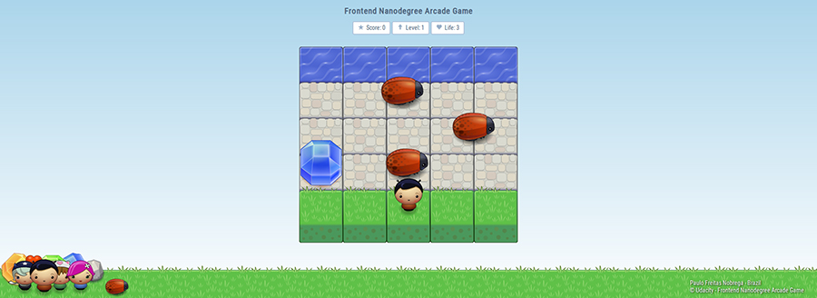

# frontend-nanodegree-arcade-game


Olá! Meu nome é **Paulo Freitas Nobrega** e esta é a minha versão do Frontend Nanodegree Arcade Game, projeto do curso de gradução Nanodegree Desenvolvedor Web Front-End oferecido pela Udacity (Conheça mais sobre a Udacity neste link (https://br.udacity.com/us/)). Frontend Nanodegree Arcade Game tem como objetivo o desenvolvimento de um jogo baseado no clássico dos fliperamas [Frogger](https://pt.wikipedia.org/wiki/Frogger). Mais detalhes na rúbrica do projeto: (https://review.udacity.com/#!/projects/2696458597/rubric).

### Instalação
Você pode fazer o download do arquivo **.zip** diretamente neste link: (https://github.com/paulofreitasnobrega/frontend-nanodegree-arcade-game/archive/master.zip)

Ou se preferir poderá utilizar o git:

```git
git clone https://github.com/paulofreitasnobrega/frontend-nanodegree-arcade-game.git
```

Após obter os arquivos, inicie o jogo executando o arquivo **index.html**.

### Como Jogar?
A mecânica é simples! Controle o personagem, ajudando-o a atravesar a rua até chegar ao rio. Pontos serão adicionados no placar do jogo toda vez que o personagem chegar ao objetivo, e vidas serão retiradas quando o mesmo for atingido no trajeto. Pontos e vidas extras serão oferecidos, em pequenos intervalos, durante todo o jogo. Somente quando o jogador perde todas as vidas disponíveis o jogo chega ao fim.

**Controle do Jogo**
Você controlará o personagem através das seguintes teclas no teclado:

- <kbd>Up</kbd>
- <kbd>Right</kbd>
- <kbd>Down</kbd>
- <kbd>Left</kbd>
- <kbd>Space Bar</kbd> - Pausa o jogo.
- <kbd>Shift</kbd> - Select - Alterna entre os personagens disponíveis.

# Para Desenvolvedores
Módulos desenvolvidos para o jogo:

- **Config**:           Configurações
- **Timer**:            Gerenciamento de tempo
- **Resouces**:         Gerenciamento dos recursos
- **Resources Loader**: Carregador de recursos
- **Scenario**:         Gerenciamento de cenários
- **Routes**:           Gerenciamento de rotas de cenário
- **Traffic**:          Gerenciamento de tráfico de inimigos
- **Scoreboard**:       Gerenciamento de placar do jogo
- **Entity Factory**:   Criador de entidades
- **Bonus Factory**:    Criador de bônus
- **Game Control**:     Controle de Jogo
- **Collision**:        Gerenciamento de colisão entre entidades

### Exemplos de utilização:
Utilize as descrições dos métodos contidas em cada módulo para obter mais informações das aplicabilidades.

**Change Config**
```javascript
// Scenario (5x5)
cols: 5,
rows: {
    water: 1,
    stone: 3,
    grass: 1
}

// TO

// Scenario (9x5)
cols: 9,
rows: {
    water: 1,
    stone: 2,
    grass: 2
}
```

**Using Config**
```javascript
// Settings selection
var resourcesConfig = config.select('resources');

// Injecting settings in a module
var resources = new Resources;
resources.setConfig(resourcesConfig);

// Using settings within the module
Resources.prototype.test = function() {
    var images = this.getConfig('images');

    // code ...
};
```

**Timer**
```javascript
// Adding timer as dependency
var timer = new Timer;
resources.addDependencies(timer);

// create future timer (in seconds)
Resources.prototype.test = function() {
    var timer   = this.getModule('timer'),
        soon    = timer.createFutureTime(10);
};

// checking the date
if (timer.isFutureTime(soon))
    console.log('Yes!');
```

**Resources**
```javascript
// Using resources in a module
Scenario.prototype.test = function() {
    var resources = this.getModule('resources');

    // Standard size of the images
    var width = resources.imageSize('width');   // 101
    var height = resources.imageSize('height');  // 83

    // One url image
    var url = resources.urlImage('characters', 'boy'); // images/char-boy.png

    // Urls of a group
    var urls = resources.urlsByImagesGroup('characters'); // array
};
```

**Resources Loader**
```javascript
var resources       = new Resources,
    ResourcesLoader = new ResourcesLoader;

// an image
var url = resources.urlImage('characters', 'boy');
resourcesLoader.singleLoad(url);

// multiple images
resourcesLoader.multipleLoad(resources.urlsByImagesGroup('characters'));

// Using the cache of loader
Player.prototype.render = function() {
    var resourcesLoader = this.getModule('resourcesloader');

    // Get
    var image = resourcesLoader.get(this.getSprite());
};
```

**Scenario**
```javascript
// Default settings
var scenario = new Scenario;
scenario.setDefaultConfig(); // (config.js)

// Specific settings
var scenario2 = new Scenario;
scenario2.setNumberColumns(5);
scenario2.addNumberRows('water', 1);
scenario2.addNumberRows('stone', 3);
scenario2.addNumberRows('grass', 2);

// Using scenario data
Test.prototype.show = function() {
    var scenario = this.getModule('scenario');

    return scenario.getNumberRows(); // 6
};
```

**Routes**
```javascript
// Creating routes
var routes = new Routes;
routes.addDependencies([scenario, resources]);
routes.create();

// Using the routes in a module
Scenario.prototype.test = function() {
    var routes = this.getModule('routes');

    // Returning grass routes
    var grass = routes.get('grass');

    // Returning grass and water routes
    var grassAndWater = routes.get(['grass', 'water']);

    // Returning last route grass
    var grassLast = routes.getFirstOrLast('last', 'grass');
};
```

**Traffic**
```javascript
// Using the traffic in a module
Bug.prototype.entry = function() {
    var traffic = this.getModule('traffic');

    // free route
    var freeRoute = traffic.getEmptyRoute(this.getTerrainsSurface());

    // entering the route
    traffic.declareRouteEntry(route);
};

Bug.prototype.output = function() {
    var traffic = this.getModule('traffic');

    // leaving the route
    traffic.declareRouteOutput(this.getRoute());
};
```

**Scoreboard**
```javascript
Gem.prototype.collided = function() {
    var scoreboard = this.getModule('scoreboard');    

    scoreboard.addScore();      // add 10
    // OR
    scoreboard.addScore(50);    // add 50
};

Bug.prototype.collided = function() {
    var scoreboard = this.getModule('scoreboard');

    scoreboard.removeLife();    // remove 1
    // OR
    scoreboard.removeLife(2);   // remove 2
};
```

**Factories**
```javascript
// Entity
var bug = entityFactory.create(Bug);

// Bonus
var gem = bonusFactory.create(Gem, config.select('bonus','gemBlue'));
```

**Exemple New Enemy**
```javascript
function Bee() {
    Enemy.call(this);
};

Bee.prototype = Object.create(Enemy.prototype);
Bee.prototype.constructor = Bee;

Bee.prototype.init = function() {
    var traffic = this.getModule('traffic');

    if (!this.isInitialized()) {
        this.setPadding(20);
        this.setEntityName('bee');
        this.setEntityGroup('enemies');
        this.addTerrainsSurface(['grass']);
        this.generateSprite();
        this.initialize();
    }

    this.setRoute(traffic.getEmptyRoute(this.getTerrainsSurface()));
    traffic.declareRouteEntry(this.getRoute());
    this.setSpeed(this.getRandomSpeed());
};
```

**Exemple New Enemy (Hibernation Cycle)**
```javascript
function Bee() {
    Enemy.call(this);
};

// code ...

Bee.prototype.init = function() {
    var traffic = this.getModule('traffic');

    if (!this.isInitialized()) {
        // code ...
        this.hibernationDuration(10);
        this.hibernationInterval(5);
        this.hibernate();
        // code ...

        this.initialize();
    }

    // code ...
};
```
