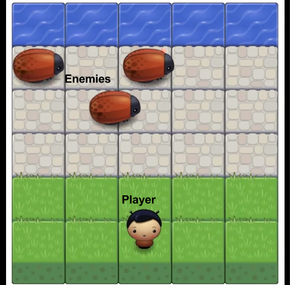

#Frogger Game: Getting Started

In this project you will be building your own arcade game. Once finished, your game should look as shown on this video:  
https://www.youtube.com/watch?v=SxeHV1kt7iU

##Frogger Game Description

Your implementation must at minimum follow the basic functionality, but you can add additional optional functionality to your game, if you wish.

##Basic Functionality

In this game you have a Player and Enemies (Bugs). The goal of the player is to reach the water, without colliding into any one of the enemies. The player can move left, right, up and down. The enemies move in varying speeds on the paved block portion of the scene. Once a the player collides with an enemy, the game is reset and the player moves back to the start square. Once the player reaches the water the game is won.

##Additional Functionality

In addition to the basic functionality, you can add more cool functionality to your game. For example, here are some additional features that you can add:  
* **Player selection:** allow the user to select the image for the player character before starting the game. You can use the different character images provided in the images folder (we’ll get to that below).  
* **Score:** you can implement a score for the game. For example, the score can increase each time the player reaches the water, and it can be reset to 0 when collision occurs (or it can be reduced).  
* **Collectables:** you can add gems to the game, allowing the player to collect them to make the game more interesting.
* Anything else you like!

##Getting Started

You won’t have to build the game from scratch. We have provided the art [assets and game engine](https://www.google.com/url?q=https://github.com/udacity/frontend-nanodegree-arcade-game&sa=D&ust=1471136325101000&usg=AFQjCNGWUBnu6FFykMphKD7N9Lzn7ciNYg) for you. You can download or clone them from our repository. If you want a little background info on how this all works and how game development in general works, read [the basics of game programming](game-programming.md).

The repository contains css, images, and js folders, as well as an index.html and a README.md file. Once you have downloaded the files we have provided, you will have to edit app.js to build the game.

* The css folder contains a style.css file which you do not need to edit
* The images folder contains the png image files, which are used when displaying the game. The images for the player and enemy character are going to be loaded from this folder.
* The js folder also contains the app engine needed to run the game and a resources.js file. You do not need to edit these files.
* index.html - opening index.html should load the game
* README.md should contain instructions on how to load and play the game (you will need to add those instructions).

Inside the app.js file, you will need to implement the *Player* and the *Enemy* classes, using Object-Oriented JavaScript. Part of the code for the Enemy is provided to you, and you will need to complete the following:  

* The Enemy function, which initiates the Enemy by:
  * Loading the image by setting this.sprite to the appropriate image in the image folder (already provided)
  * Setting the Enemy initial location (you need to implement)
  * Setting the Enemy speed (you need to implement)
* The update method for the Enemy
  * Updates the Enemy location (you need to implement)
  * Handles collision with the Player (you need to implement)
* You can add your own Enemy methods as needed

You will also need to implement the Player class, and you can use the Enemy class as an example on how to get started. At minimum you should implement the following:
* The Player function, which initiates the Player by:
  * Loading the image by setting this.sprite to the appropriate image in the image folder (use the code from the Enemy function as an example on how to do that)
  * Setting the Player initial location
* The update method for the Player (can be similar to the one for the Enemy)
* The render method for the Player (use the code from the render method for the Enemy)
* The handleInput method, which should receive user input, allowedKeys (the key which was pressed) and move the player according to that input. In particular:
  * Left key should move the player to the left, right key to the right, up should move the player up and down should move the player down.
  * Recall that the player cannot move off screen (so you will need to check for that and handle appropriately).
  * If the player reaches the water the game should be reset by moving the player back to the initial location (you can write a separate reset Player method to handle that).
* You can add your own Player methods as needed.

Once you have completed implementing the Player and Enemy, you should instantiate them by:
* Creating a new Player object
* Creating several new Enemies objects and placing them in an array called allEnemies

##Adding your own

If you would like you can add additional functionality to the game. You can add more code to the app.js file and to the Enemy and Player classes to accomplish that.
